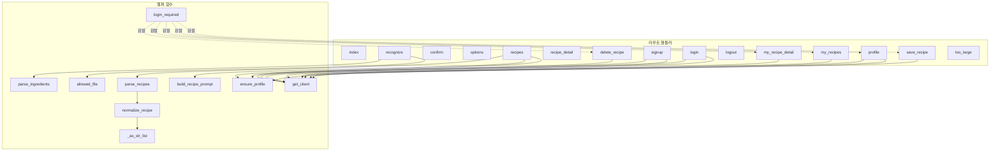
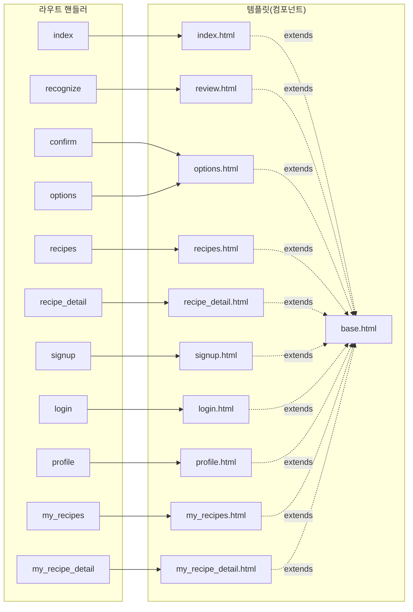

# 아키텍처 다이어그램

`app.py`와 `templates/`에 직접 정의된 함수·템플릿만을 대상으로 합니다. Flask/OpenAI/Supabase 등 외부 라이브러리 호출은 표현하지 않았습니다.

## 1. 함수 호출 관계도

## 2. 라우트 → 템플릿 렌더링 & 템플릿 상속 구조

`save_recipe`, `logout`, `delete_recipe`, `too_large`는 `render_template`을 호출하지 않고 `redirect`만 수행하므로 다이어그램 2에서 제외했습니다.
